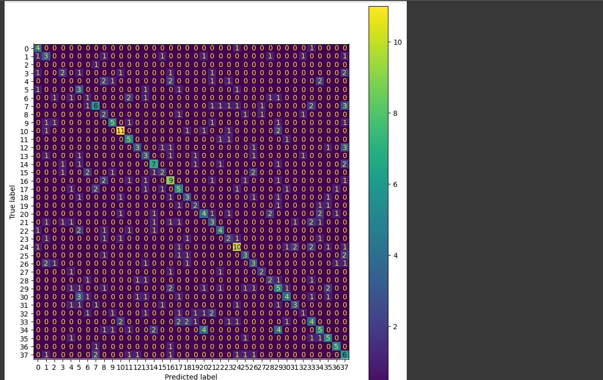

# 🩺 Disease Classification - End-to-End ML Project

This is a complete end-to-end machine learning project that tackles multi-class disease classification based on symptom data. Given the highly imbalanced dataset with 38 disease classes and only 2000 records, standard models underperformed. This project uses **XGBoost** combined with **SMOTE oversampling** to improve classification performance on rare diseases, and deploys the model through:
- **FastAPI**: RESTful API for model inference
- **Streamlit**: Interactive web-based UI for predictions

## 🔍 Problem Statement
- **Goal**: Predict the correct disease label (out of 38) based on symptoms.
- **Input**: Tabular symptom data (e.g., fever, nausea, rash)
- **Output**: Disease class label

## 📊 Dataset
- 2000 patient records
- 10 binary symptoms features
- 1 target label (disease class)
- Severe class imbalance: some diseases have <10 samples

## 🧪 Baseline Model
| Model         | Accuracy      | Macro F1     | Zero-F1 Classes   |
|---------------|-------------|-----------|------------|
| Decision Tree | 31%       | 0.29        | 9+    |
| **XGBoost + SMOTE** | **37%** | **0.35** | **1** | 

## ⚙️ Techniques Used
- **SMOTE** for minority class oversampling
- **XGBoost** (multi: softmax, 38 classes)
- Focused on **Macro F1-Score** due to class imbalance
- Preprocessing: `StandardScaler`, `LabelEncoder`

## 📈 Evaluation
```plaintext
Accuracy:        0.37
Macro F1-score:  0.35
Weighted F1:     0.37
```
Per-class F1 improved substantially. Only 1 class had F1 = 0 (vs 9 in baseline)

## 🌐 API & Frontend

### FastAPI Endpoints
- `POST /predict`: Submit symptoms and receive disease prediction
- `GET /health`: Check API status
- `GET /docs`: Interactive API documentation

### Streamlit Interface
User-friendly web interface allowing users to:
- Input symptoms via checkboxes/dropdowns
- Get instant disease predictions
- View prediction confidence scores
- Visualize model results

## 📦 Libraries
### Machine Learning
`pandas`  
`scikit-learn`  
`imbalanced-learn`  
`xgboost`  
`matplotlib`  

### Deployment & UI
`fastapi`  
`uvicorn`  
`streamlit`  
`pydantic`

## 🚀 Project Structure
- **Disease_Prediction_Project.ipynb**: Complete ML pipeline (training, SMOTE, model evaluation, and model export)
- **main.py**: FastAPI server exposing prediction endpoint
- **app.py**: Streamlit UI for interactive disease prediction
- **improved_disease_dataset.csv**: Training dataset (2000 records, 10 symptom features)
- **disease_prediction_model.pkl**: Trained XGBoost model
- **scaler.pkl**: StandardScaler for feature normalization
- **label_encoder.pkl**: LabelEncoder for disease labels

## 🔧 How to Run

### 1. Train the Model
Open and run the Jupyter notebook:
```bash
jupyter notebook Disease_Prediction_Project.ipynb
```
This will generate the model files (`.pkl` files) needed for deployment.

### 2. Start FastAPI Server
```bash
python main.py
```
Or using uvicorn:
```bash
uvicorn main:app --reload
```
API will be available at `http://localhost:8000`  
Swagger docs at `http://localhost:8000/docs`

### 3. Launch Streamlit UI
```bash
streamlit run app.py
```
Interactive UI will open in your browser  

--- 

*Confusion Matrix*: 